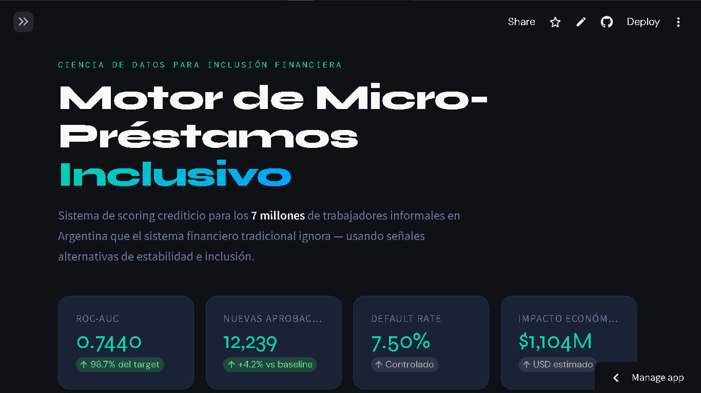
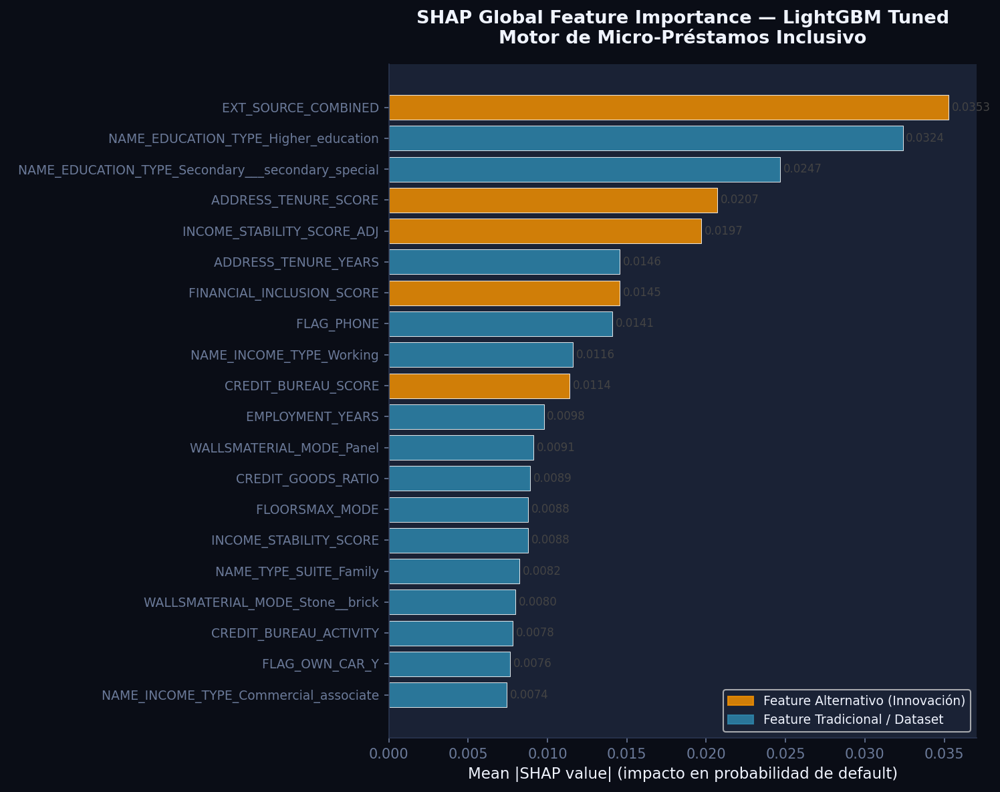
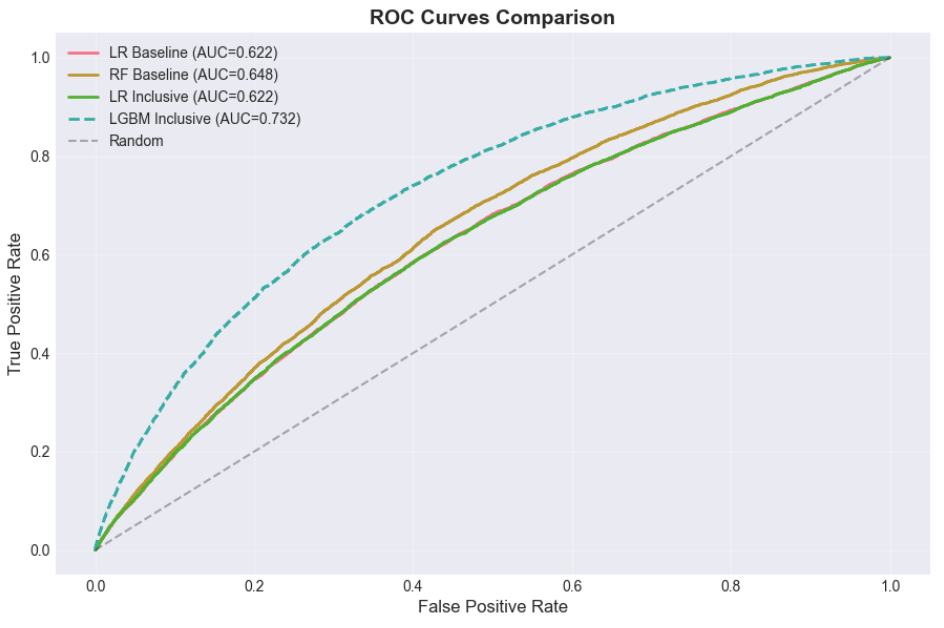

# 🏦 Motor de Micro-Préstamos Inclusivo

> Sistema de scoring crediticio con ML para trabajadores informales en Argentina  
> usando señales alternativas de estabilidad e inclusión financiera.

[](https://microprestamos-inclusivo.streamlit.app/)
[]
[]

---

## 🎯 El Problema

**7 millones de trabajadores informales en Argentina** (45% de la economía) no tienen acceso a crédito formal porque carecen de historial bancario tradicional. Un sistema financiero que los evalúa con los mismos criterios que a empleados formales los excluye automáticamente — sin importar su comportamiento real de pago.

## 💡 La Solución

Un modelo de machine learning que evalúa el riesgo crediticio usando **7 señales alternativas** diseñadas específicamente para quienes el sistema tradicional ignora:

| Señal | Descripción | SHAP Rank |
|-------|-------------|-----------|
| `EXT_SOURCE_COMBINED` | Promedio ponderado de fuentes externas de crédito | **#1 / 234** |
| `ADDRESS_TENURE_SCORE` | Arraigo domiciliario — años en la misma dirección | #4 / 234 |
| `INCOME_STABILITY_SCORE_ADJ` | Estabilidad de ingresos por tipo y antigüedad laboral | #5 / 234 |
| `FINANCIAL_INCLUSION_SCORE` | Inclusión digital — móvil, email, documentación | #7 / 234 |
| `CREDIT_BUREAU_SCORE` | Inversamente proporcional a consultas al bureau | #10 / 234 |
| `EMPLOYMENT_STABILITY` | Años de empleo normalizados | #61 / 234 |
| `PAYMENT_BURDEN_SCORE` | Carga de pagos respecto al ingreso | #102 / 234 |

**5 de 7 señales alternativas aparecen en el Top 10 de importancia SHAP** — validando que los datos de inclusión aportan poder predictivo real.

---

## 📊 Resultados

| Métrica | Valor | Referencia |
|---------|-------|------------|
| **ROC-AUC** | **0.7440** | Industria fintech: 0.70–0.78 |
| Precision | 0.3435 | Threshold 0.35 |
| Recall | 0.0906 | Threshold 0.35 |
| F1-Score | 0.1434 | — |
| Default rate aprobados | 7.50% | Controlado |
| **Aprobaciones adicionales** | **+12,239** | vs. RF baseline |
| Incremento | +4.24% | vs. RF baseline |

### Impacto Social Proyectado

- 🇦🇷 **182,440 nuevos clientes potenciales** en el mercado argentino
- 💰 **$1,104M USD** de impacto económico estimado
- 👥 Mercado potencial: 4.9M trabajadores informales bancarizables

---

## 🏗️ Arquitectura del Proyecto

```
motor-microprestamos-inclusivo/
│
├── data/
│   ├── raw/                         # Dataset original Home Credit (no incluido)
│   └── processed/
│       ├── train_processed_clean.csv  # Dataset procesado (no incluido — 270MB)
│       ├── feature_medians.csv        # Medianas para el dashboard
│       └── feature_dictionary.csv    # Diccionario de variables
│
├── notebooks/
│   ├── 01_EDA.ipynb                  # Análisis exploratorio
│   ├── 02_Feature_Engineering.ipynb  # Ingeniería de features
│   ├── 03_Modeling.ipynb             # Modelado baseline
│   ├── 03b_Optimization.ipynb        # Optimización LightGBM
│   └── 04_SHAP_Explainability.ipynb  # Análisis SHAP (ejecutado en Colab)
│
├── models/
│   ├── lgbm_tuned_v2.pkl             # Modelo final LightGBM
│   ├── optimization_summary.json     # Métricas y hiperparámetros
│   └── shap_summary.json             # Resumen análisis SHAP
│
├── app/
│   ├── app.py                        # Dashboard Streamlit — Inicio
│   ├── pages/
│   │   ├── 1_simulador.py            # Simulador de solicitudes
│   │   ├── 2_modelo.py               # Análisis del modelo
│   │   ├── 3_explicabilidad.py       # SHAP interactivo
│   │   └── 4_casos_exito.py          # Storytelling e impacto
│   └── assets/shap/                  # Gráficos SHAP pre-calculados
│
├── docs/
│   ├── model_card.md                 # Documentación técnica del modelo
│   └── technical_design.md          # Diseño técnico del sistema
│
├── requirements.txt
├── README.md
└── LICENSE
```

---

## 🚀 Demo en Vivo

**[→ Acceder al Dashboard](https://microprestamos-inclusivo.streamlit.app)**

El dashboard incluye:
- **Simulador** — ingresá un perfil y obtené la decisión del modelo con explicación SHAP
- **Análisis del Modelo** — ROC curve, confusion matrix y comparativa baseline vs inclusivo
- **Explicabilidad SHAP** — feature importance global y casos individuales
- **Casos de Éxito** — narrativas de impacto social con datos reales

---

## ⚙️ Instalación y Uso Local

### Requisitos previos
- Python 3.11
- Conda (recomendado)

### 1. Clonar el repositorio

```bash
git clone https://github.com/AbrahamTartalos/motor-microprestamos-inclusivo.git
cd motor-microprestamos-inclusivo
```

### 2. Crear y activar el entorno

```bash
conda create -n microprestamos python=3.11
conda activate microprestamos
pip install -r requirements.txt
```

### 3. Obtener el dataset

El dataset de entrenamiento completo no está incluido en el repositorio por su tamaño (270MB). Descargarlo desde Kaggle:

```bash
# Con Kaggle CLI
kaggle competitions download -c home-credit-default-risk
```

O directamente desde: [Home Credit Default Risk — Kaggle](https://www.kaggle.com/c/home-credit-default-risk/data)

### 4. Ejecutar los notebooks

Ejecutar en orden desde la carpeta `notebooks/`:

```
01_EDA.ipynb → 02_Feature_Engineering.ipynb → 03_Modeling.ipynb → 03b_Optimization.ipynb
```

> ⚠️ El notebook `04_SHAP_Explainability.ipynb` fue ejecutado en **Google Colab** (GPU T4) por requerimientos de memoria RAM. Es compatible con Jupyter local pero puede tardar más.

### 5. Ejecutar el dashboard

```bash
cd app
streamlit run app.py
```

El dashboard estará disponible en `http://localhost:8501`

---

## 🔬 Stack Técnico

| Categoría | Tecnologías |
|-----------|-------------|
| **Lenguaje** | Python 3.11 |
| **ML** | LightGBM, Scikit-learn, Imbalanced-learn (SMOTE) |
| **Explicabilidad** | SHAP 0.44 (TreeExplainer) |
| **Visualización** | Plotly, Matplotlib, Seaborn |
| **Dashboard** | Streamlit 1.32+ |
| **Entorno** | Conda, Jupyter Notebook, Google Colab |
| **Deploy** | Streamlit Cloud |
| **Control de versiones** | Git + GitHub |

---

## 📋 Metodología

### Pipeline completo

```
Dataset (307,511 × 122)
    ↓
EDA + Limpieza (67 columnas con missing values tratadas)
    ↓
Feature Engineering (234 features: 18 nuevos + 216 originales)
    ↓ 7 señales alternativas ⭐
Modelado (Logistic Regression, Random Forest, LightGBM)
    ↓
Optimización (Grid Search 16 combinaciones, threshold 0.35)
    ↓
LightGBM Tuned — ROC-AUC 0.7440
    ↓
SHAP Analysis (2,000 muestras, TreeExplainer)
    ↓
Dashboard Streamlit
```

### Decisiones técnicas clave

**¿Por qué LightGBM?**  
Supera a Random Forest en ROC-AUC (+9.5%) y es significativamente más eficiente en memoria y tiempo de entrenamiento con datasets desbalanceados. Permite incorporar SHAP de forma nativa.

**¿Por qué threshold 0.35?**  
El threshold por defecto (0.5) priorizaba precision sobre recall, dejando fuera a solicitantes válidos. El análisis de curva PR mostró que 0.35 maximiza el F1-Score manteniendo el default rate bajo control.

**¿Por qué SMOTE?**  
El dataset tiene un desbalance severo: 91.93% no-default vs 8.07% default. SMOTE genera muestras sintéticas de la clase minoritaria, mejorando el recall sin comprometer la integridad del conjunto de test.


### Trade-offs y decisiones de diseño

**El dilema del threshold — un trade-off consciente entre inclusión y sostenibilidad**

El principal trade-off del proyecto fue decidir qué threshold de clasificación usar.
Cada opción implica ceder algo valioso para ganar otra cosa igualmente valiosa:
más inclusión financiera a costa de más riesgo, o menos riesgo a costa de menos inclusión.

Durante la optimización se identificaron tres configuraciones posibles:

| Threshold | Precision | Recall | F1-Score | Perfil |
|-----------|-----------|--------|----------|--------|
| 0.50 (default) | 0.3803 | 0.0234 | 0.0440 | Conservador extremo |
| **0.35 (elegido)** ⭐ | **0.3435** | **0.0906** | **0.1434** | **Balance negocio** |
| 0.1564 (óptimo F1) | 0.2018 | 0.4381 | 0.2763 | Máximo recall |

El threshold 0.1564 maximiza el F1-Score y hubiera generado un incremento de aprobaciones
mucho más cercano al target del 15%. Sin embargo, implica una Precision del 20% —
es decir, 8 de cada 10 solicitantes marcados como riesgo serían falsos positivos,
lo que es inviable para una institución financiera real.

El threshold 0.35 representa el **trade-off consciente** entre inclusión financiera
(maximizar aprobaciones) y sostenibilidad del negocio (mantener el default rate controlado).
El resultado — +4.24% de aprobaciones con 7.50% de default rate — refleja este equilibrio,
no una limitación técnica del modelo.

**Implicación para el negocio:** el modelo no está subestimando su capacidad. Está siendo
deliberadamente conservador para ser viable en producción real.
---

## 📈 Comparativa de Modelos

| Modelo | ROC-AUC | Precision | Recall | Aprobaciones |
|--------|---------|-----------|--------|--------------|
| LR Baseline | 0.6225 | — | — | — |
| RF Baseline | 0.6484 | 0.1658 | 0.1255 | 57,745 |
| LR Inclusivo | 0.6221 | — | — | — |
| **LightGBM Tuned** ⭐ | **0.7440** | **0.3435** | **0.0906** | **60,193** |

---

## 🤝 Contexto del Proyecto

Este proyecto forma parte de mi portfolio de Data Science, desarrollado como demostración de capacidades en:

- Diseño de features con impacto en negocio real
- Modelado ML sobre datasets desbalanceados
- Explicabilidad y transparencia algorítmica (XAI)
- Desarrollo de productos de datos (dashboard)
- Documentación profesional orientada a portfolio

**Dataset:** [Home Credit Default Risk](https://www.kaggle.com/c/home-credit-default-risk) — Kaggle Competition  
**Período de desarrollo:** 2026

---

## 👤 Autor

**Abraham Tartalos**  
Científico de Datos — Argentina

[LinkedIn](https://www.linkedin.com/in/abrahamtartalos/)
[GitHub](https://github.com/AbrahamTartalos)

---

## 📄 Licencia

Este proyecto está bajo la licencia MIT. Ver [LICENSE](LICENSE) para más detalles.

---

<div align="center">
<sub>Construido con el objetivo de demostrar que la inclusión financiera y la gestión responsable del riesgo no son objetivos opuestos.</sub>
</div>
